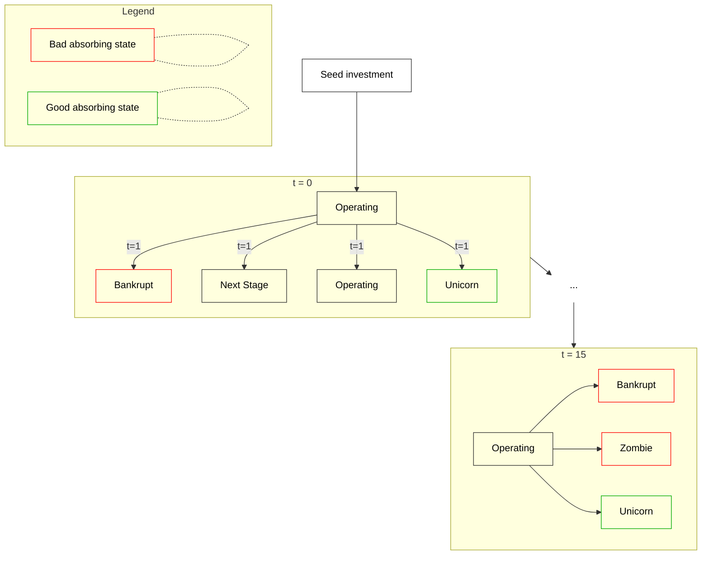

# Bayesian Inference & Markov Chain for Venture Capital
The idea is to propose a model based on Bayesian inference to calculate the probability of a Seed stage investment turning into a unicorn within 10 years.  

### Description of the model
The model mixes the **Multinomial distribution**, the **Dirichlet prior** and **Markov chain** to estimate the **probability of an investment made at the seed stage to become a unicorn over 10 years** (usual lifetime of a VC fund). Here is a detail description of the Markov Chain:

Every year, the startup can either move to the next round (this is the event called **“Next Stage”**), stays at the current stage (**“Operating” state**) or enter a finite event, going **“bankrupt”** being the “bad absorbing state” and becoming a **“unicorn”** being the “good absorbing state”. 
The seed stage is the initial stage, and the experiment always start at the operating level. After that, we use prior probabilities for each event, and the idea is to update those probabilities every year. So we start at t = 0, and we go until t = 10. 
If the startup goes bankrupt, it cannot advance to the next stage. If it is in the operating stage, it can either go to the next stage (so for instance go from Seed to Series A) or stays in the operating state and just repeats the current round. 

Here are the priors:

At the seed stage, the startup can: - raise a Series A with a 27% chance
-	Goes bankrupt with a 40% chance
-	Stays in the operating state with a 22% chance
-	Becomes a unicorn with 1% chance
  
At the series A stage, the startup can: - raise a Series B with a 30% chance
-	Goes bankrupt with a 40% chance
-	Stays in the operating state with a 19% chance
-	Becomes a unicorn with 1% chance
  
At the series B stage, the startup can: - raise a Series C with a 26% chance
-	Goes bankrupt with a 29% chance
-	Stays in the operating state with a 43% chance
-	Becomes a unicorn with 2% chance

At the series C stage, the startup can: - raise another round with a 32% chance
-	Goes bankrupt with a 25% chance
-	Stays in the operating state with a 38% chance
-	Becomes a unicorn with 5% chance

After the Series C, when raising another round, the company repeats the Series C stage.

Finally, at t =10, the startup can only enter three absorbing states with the following prior probabilities:
-	Goes bankrupt with a 20% chance
-	Enters Zombie state with a 75% chance
-	Becomes a unicorn with 5% chance
  
**Zombie** state means the startup will never generate an interesting liquidity event for the investor.

You can find a transition diagram below to visualize better the model. 

## Model State Transition Diagram

The following diagram shows possible state transitions for a startup at different time points:

With the current priors, the probability of investing into a future unicorn at the seed stage is  **2.93%** with a **95% CI [[2.58%, 3.27%]]**.

The idea is to **update the priors of the model with new investments made every year to refine them depending on the investment thesis** and see how many startups become a unicorn after 10 years after repeating n investments to have a better idea of the probability of startup turning into a unicorn after investing at the seed stage. That way, each investor can have a better understanding of the probability of success fitting their investment thesis while investing under uncertainty. This will be their probability of investing into unicorn, since the model will be updated with their investments. This allow to take into consideration each factor specific to each investor: Personal Network, Geography, Sectors, Founders targeted etc. 

### Origin of the priors

The advantage of using Bayesian inference over a Frequentist approach is that the influence of the initial prior quickly disappear when adding new information. 
That being said, we can still use some data to have a better start instead of just guessing. 

In 2021, Angellist published a [report](https://www.angellist.com/blog/angellist-unicorn-rate) stating that 2.5% of the deals done at the seed stage on the platform would turn later on into a unicorn (sample of 2,600 deals since 2013). That can be a good enough proxy for the initial prior of the probability we are trying to inference with the model.

For the transition priors (probability of going from the Seed stage to the Series A stage for instance), we can use data from CBInsights:

| Funding Stage | 2014 - Mid 2025 | Before 2014 | Total |
|---------------|----------------:|------------:|------:|
| Seed          | 189,750         | 33,665      | 223,415 |
| Series A      | 60,077          | 30,299      | 90,376 |
| Series B      | 27,312          | 19,537      | 46,849 |
| Series C      | 12,329          | 8,884       | 21,213 |
| Series D+     | 9,041           | 6,725       | 15,766 |

We can then use the following formula to get a very rough estimate of the transition probabilities (Number of deal between 2014 - 2025 at the next stage / Total deals current stage):

| Current Stage | Next Stage | Progression Rate |
|---------------|------------|----------------:|
| Seed          | Series A   | 27% |
| Series A      | Series B   | 30% |
| Series B      | Series C   | 26% |
| Series C      | Series D+  | 32% |

Those probabilities are probably overestimated but it does not matter because they are just rough priors that will get quickly replaced with more relevant data fitting each individual investor.

For the rest of the priors, we can just assume that the probability of becoming a unicorn will always be close to 1%, only getting slightly higher at the Series C stage, and for the other two, we can just "guesstimate" to reach 1. 

Overall, those priors were just examples on how to start from a frequentist approach, and use a bayesian approach to refine the probabilities as new information becomes available. Each investor can use a more fitting approach to their personal case to get better priors.
